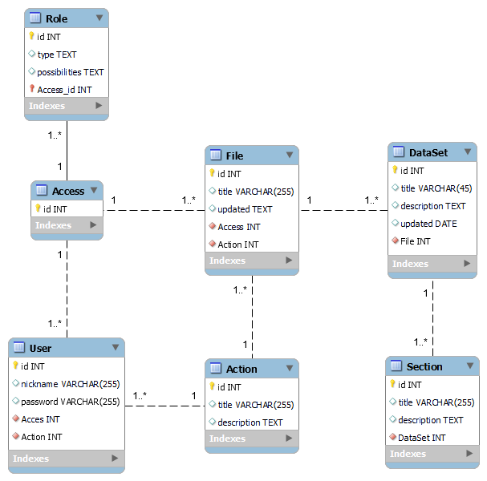

# Проєктування бази даних

В рамках проекту розробляється:
## ER-модель

@startuml

entity User {
    id: NUMBER
    nickname: TEXT
    password: TEXT
}

entity Role {
type: TEXT
possibilities: LIST
}

entity Access {}

entity File {
title: TEXT
updated: DATE
}

entity Action {
title: TEXT
description: TEXT
}

entity DataSet {
title: TEXT
description: TEXT
updated: DATE
}

entity Section {
title: TEXT
description: TEXT
}

User "1,1" <-u- "0," Access
Role "1,1" <-- "0," Access
Access "0," --> "1,1" File
Action "0,*" -l-> "1,1" File
File "0," --> "1," DataSet
DataSet "0," -r-> "1," Section
Section "1,1" --> "0," Section
Action "0,*" -u-> "1,1" User

@enduml

***
## Pеляційна схема

